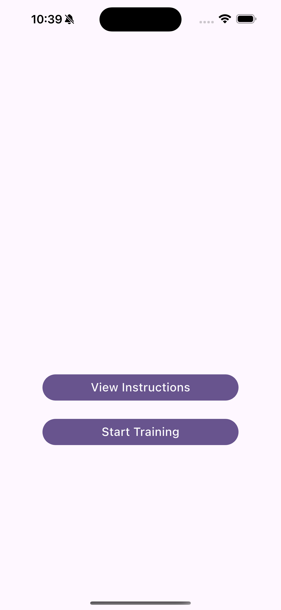
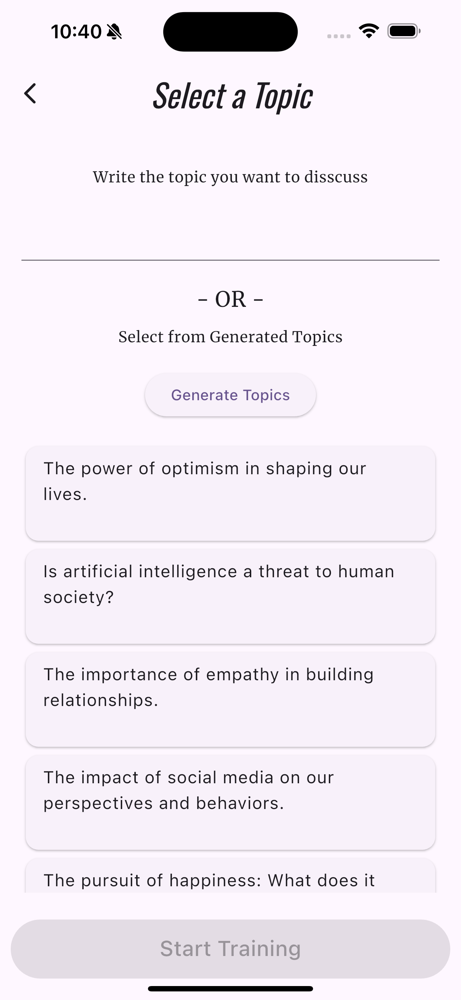
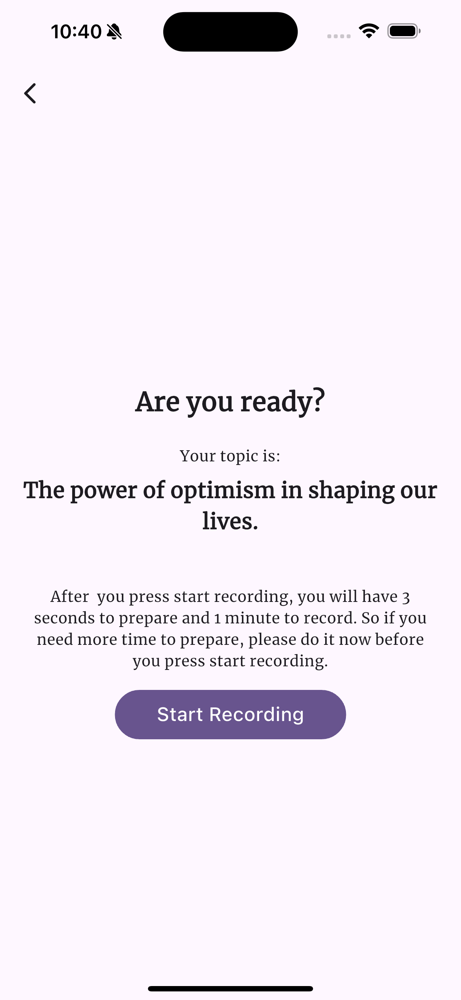
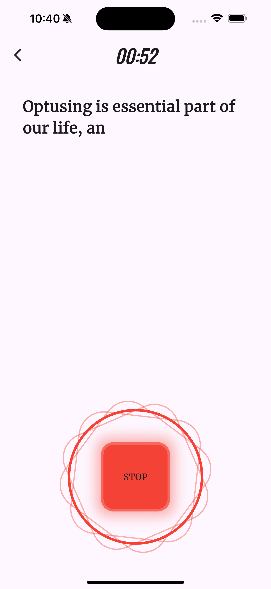
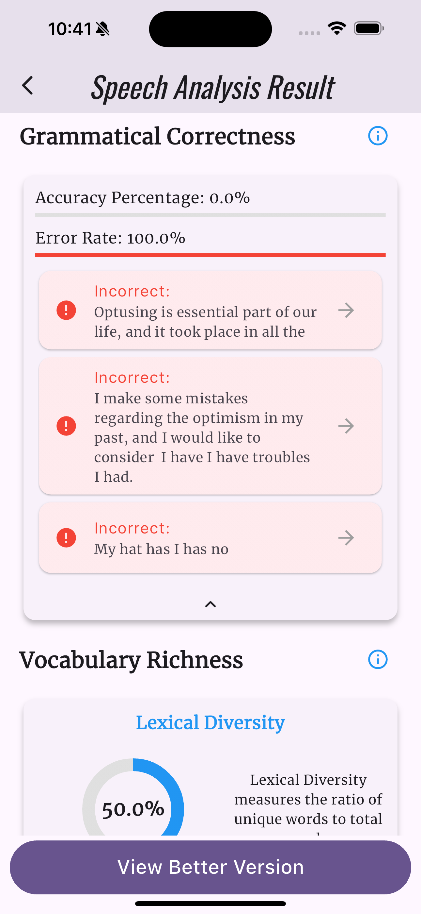
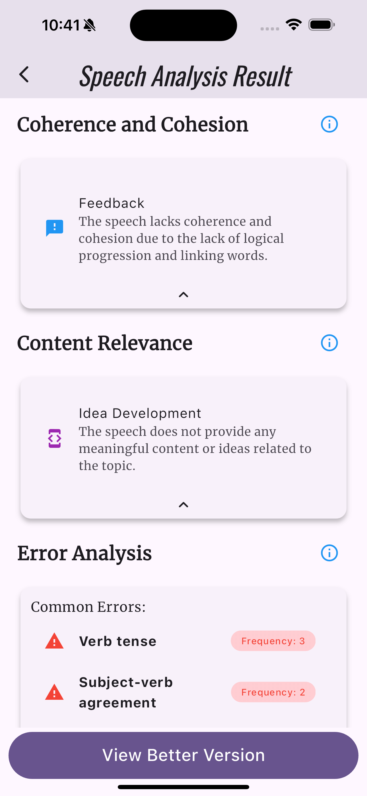

# Fluency Practice App
Android, iOS, and Web

## Overview

The **Fluency Practice App** is designed to help users practice and improve their speaking fluency. The app allows users to:
- Select or write a topic for discussion.
- Record their speech for analysis.
- Receive detailed feedback on fluency, clarity, and vocabulary.
- View and listen to an improved version of their speech.

---
## Screenshots

<table>
  <tr>
    <td align="center">
      
      <br/>
      <b>Intro screen</b>
    </td>
    <td align="center">
      
      <br/>
      <b>Topics screen</b>
    </td>
    <td align="center">
      
      <br/>
      <b>Confirmation screen</b>
    </td>
  </tr>
  <tr>
    <td align="center">
      
      <br/>
      <b>Recording screen</b>
    </td>
    <td align="center">
      
      <br/>
      <b>Analysis screen</b>
    </td>
    <td align="center">
      
      <br/>
      <b>Analysis screen</b>
    </td>
  </tr>
</table>


## Getting Started

### Prerequisites

Ensure you have the following installed on your machine:

- **Flutter SDK**: [Download and install](https://flutter.dev/docs/get-started/install).
- **Dart SDK**: Included with Flutter.
- **Development Environment**: VS Code, Android Studio, or any IDE that supports Flutter.
- **API Keys**:
  - **Deepgram API Key**: For speech processing.
  - **Google AI API Key**: For speech-to-text analysis.
- **Web deployment**: [See the instructions](https://docs.flutter.dev/deployment/web).

---

### Installation Steps

1. **Clone the Repository**:
   ```bash
   git clone git@github.com:merdandt/fluency_practice.git
   cd fluency_practice

2.  **Install Dependencies**:
   ```bash
   flutter pub get
   ```
3. **Obtain API Keys:**

- Deepgram API Key:
    - (Sign up)[https://deepgram.com/] on Deepgram and create a project.
    - Generate an API key and include it in `app-config.json`.

- Google AI API Key:
    - Go to the (Google Cloud Console)[https://aistudio.google.com/].
    - Generate an API key and include it in `app-config.json`.

4.  **Set Up Environment Configuration**:

- Navigate to (or create) the `env/config/` directory.
- Create or update the `app-config.json` file with the required API keys and other configurations.
- Example structure of `app-config.json`:

```json
{
  "GOOGLE_AI_API_KEY": "your-google-ai-api-key",
  "DEEPGRAM_API_KEY":"your-deepgram-api-key",
}
```


### Features

**Speech Recording:**
- Choose or write a topic for discussion.
- Record your speech directly in the app.

**Speech Analysis:**
- Get feedback on various aspects of your speech, such as fluency, clarity, and vocabulary.

**Better Version:**
- Receive suggestions for improving your speech.
- Listen to the improved version for comparison and learning.

**Interactive Experience:**
- Practice fluency in a user-friendly interface with immediate feedback.

